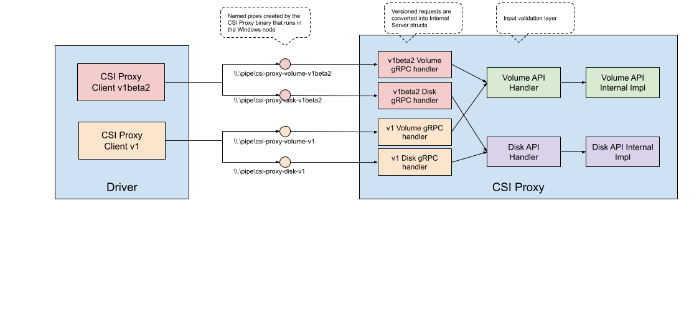

# Development

## Code generation

This project uses:

- `protoc` to generate `pb.go` files from `proto` files, this is used in the client module only
- `csi-proxy-api-gen` to generate `_generated.go` files, it's used both in the client module and in the server module

Read the [`Makefile`](./Makefile) for more details and the descriptions below to understand what targets to call

## High Level Overview



## Code structure

- `client` - Client module (used by the drivers)
  - `api` - Client API, versioned and compiled from `api.proto` files
  - `groups` - Client API factory, the drivers will interact with methods of the wanted group/version from this folder, these methods use the structs defined in `client/api`
- `pkg` - Server side code
  - `server.go` - Server entry point, invoked by the `csi-proxy` binary
  - `server/<group>/impl/<version>/server_generated.go` - First gRPC layer, once the gRPC server receives a request, it'll send it to these GRPC handlers, these handlers will convert a client versioned request e.g. a request from `v1beta2` or `v1beta3` to an internal server representation (see `impl/types.go`) that doesn't have specific information about the version of a client.
  - `server/<group>/impl/types.go` - All requests regardless of the client version used are converted into the structs declared here, structs of these types are what the server is aware of.
  - `server/<group>/impl/types_generated.go` - The API exposed by the server API handler, it needs to match requests that may come from any client version.
  - `server/<group>/server.go` - Server API handlers that implements `types_generated.go` and perform server side validations, once client requests are converted into the internal server structs they go through methods exposed here and invoke `os/<group>` methods.
  - `os/<group>/` - The internal server implementation of the csi-proxy API.

Additional notes about the API files:

- [API](./API.md)

Additional notes about some autogenerated files:

- `pkg/server/<group>/impl/<version>/conversion_generated.go` - In the First gRPC layer requests may come from different versioned clients, the server works with internal structs that don't have any info about a specific client request, there's the need of conversion functions that remap properties from a client to the internal server structs, this file has functions with autogenerated mappings (overrides can be specified through `conversion.go` see #138)
  - NOTE: some of the functions may be declared but may not be used, this happens if there's an override in `conversion.go` for that function.
- `pkg/server/<group>/api_group_generated.go` - Creates server handlers for all the known API versions for the `<group>`

## Making changes to the client module

Some notes about changing code to the client module:

- APIs that were already released should be considered immutable, if the protoc compiler overwrites changes in released APIs we should undo these changes.

When there are changes to the to client module:

- Remove the `vendor` directory
- If a `client/api/<group>/api.pb.go` needs to be regenerated, delete it first
- If a `client/groups/<group>/<version>/client_generated.go` needs to be regenerated, delete it first
- Compile the proto files `make generate-protobuf` (there will be a lot of warnings and an error, just make sure that your desired protobuf was generated)
- Generate `client_generated.go` with `make generate-csi-proxy-api-gen`
- Compiling the proto files overwrote the `pb.go` files for older files, make sure you undo those changes because we consider released `api.proto` and `api.pb.go` files immutable.

```shell
# for example when I was working on making changes to the v1beta3 volume API
# I had to do the following to restore the changes protoc made to the other APIs
git restore client/api/volume/v1beta{1,2} client/api/{disk,iscsi,system,smb,filesystem}
```

- Finally after checking that only `client/api/<group>/<version>/api.pb.go` and `client/groups/<group>/<version>/client_generated.go` were created/modified, sync these files to the vendor folder with `go mod vendor`, verify that the wanted files were generated with `git status`

## Making changes to the server module

Some notes about making changes to the server module:

- Make sure that the `vendor` folder is up to date with the latest code from the client code.
- Always remember to delete a file that was generated otherwise it won't be generated again even if there
  are changes that should make it autogenerate.
- Autogenerated files shouldn't be edited by hand, instead if there's a special conversion from a specific
  client API version to an internal server version use the `conversion.go` file

When there are changes to the server module:

- Delete the autogenerated files, for example when I was working on
  making changes to the volume API I deleted all the `_generated.go` files

```shell
find pkg/server/volume -name "*_generated.go" | xargs rm
```

- Generate the `_generated.go` files with `make generated-csi-proxy-api-gen`
- Update the unit tests in `pkg/server/<group>/server_test.go`
- Update the integration tests in `integrationtests/`

## Bumping versions

- Copy all the non-generated client files from the desired groups e.g. from `v1beta2` to `v1beta3` and run the compiler
  (see [#making changes to the client module](#making-changes-to-the-client-module)), **remember not to overwrite old API files!**
- Copy server API handlers for the desired group e.g. `pkg/server/<group>/impl/<version>/conversion.go`, **remember to delete the auto generated files first!**

The steps above are implemented in `scripts/bump-version.sh`

If there are any non-backward compatible changes (for example renaming a parameter or a method)

- Make sure that `types.go` reflects what we should know of the internal server structs
- Remap old parameters in previous API versions e.g. let's say that we make a remap in `v1beta3` then we need to updated `v1alpha1`, `v1beta1`, etc. using the `conversion.go` file. (see #138)
- Update `pkg/<group>/server.go` if there are new methods, the old methods should forward the request (see #138)

Also make sure you copy and execute the corresponding API integration test in `integrationtests/`

## Running E2E tests

There are a few presubmit tests that run in Github Actions, E2E tests need to run in a Windows VM with Hyper-V enabled, to run the E2E tests in Google Cloud follow this workflow:

- Modify scripts/e2e-runner.ps1 to use your repo/branch
- Create a windows VM for csi-proxy with scripts/e2e-tests.sh, after the instance is initialized it'll build csi-proxy and attempt to run the E2E tests

During development we need to iterate faster, I follow this workflow during development:

- Make changes to the codebase locally and push to the remote
- RDP to the VM and open a few powershell terminals (with `start powershell`)
- Pull the changes from the remote, recompile and start csi-proxy and run the E2E tests

```bash
cd ~/go/src/github.com/kubernetes-csi/csi-proxy
git fetch; git pull --rebase origin $BRANCH

# terminal 1 (build and start CSI proxy)
go build -v -a -o ./bin/csi-proxy.exe ./cmd/csi-proxy
.\bin\csi-proxy.exe --v=5

# terminal 2 (run E2E tests)
go test -v .\integrationtests\ -run TestVolumeAPIs
```

You can also edit the files directly in the VM using vim or a similar editor.
