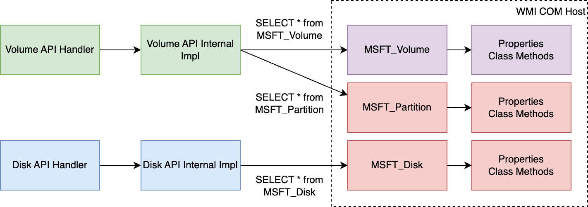

# CSI Proxy API Implementation with WMI
<a name="top"></a>

## Table of Contents

- [Windows Management Instrumentation](#wmi)
- [microsoft/wmi library](#microsoft-wmi-library)
- [How to make WMI queries and debug with PowerShell](#debug-powershell)


<a name="wmi"></a>
## Windows Management Instrumentation

Windows Management Instrumentation (WMI) is the infrastructure for management data and operations on Windows-based operating systems.
Refer to [WMI start page](https://learn.microsoft.com/en-us/windows/win32/wmisdk/wmi-start-page) for more details.

The purpose of WMI is to define a proprietary set of environment-independent specifications that enable sharing management information between management apps.

CSI-proxy makes WMI queries using `microsoft/wmi` library. Refer to for the call graph below.

<a name="microsoft-wmi-library"></a>
## microsoft/wmi library



`microsoft/wmi` library leverages the traditional COM interfaces (`IDispatch`) to call the WMI.

COM interfaces wrap the parameters and return value in a `VARIANT` struct.
`microsoft/wmi` library converts the `VARIANT` to native Go types and struct.

A typical WMI query may need to obtain a WMI session of the target machine first, which
can be done by the helper methods `NewWMISession` and `QueryFromWMI` in `pkg/cim`.

A query like `SELECT * FROM MSFT_Volume` may return all the volumes on the current node.

### Queries

The query may return a list of WMI objects of the generic type `cim.WmiInstance`. You may further cast
the object down to a specific WMI class (e.g. `MSFT_Disk`). You may find the WMI class definition
from the API doc.

For example, the property `PartitionStyle` on [MSFT_Disk](https://learn.microsoft.com/en-us/windows-hardware/drivers/storage/msft-disk#properties) is defined as

| API constraints | Settings                              |
|-----------------|---------------------------------------|
| Property        | PartitionStyle                        |
| Data type       | UInt16                                |
| Access type     | Read-only                             |
| Qualifiers      | Required                              |
| Description     | The partition style used by the disk. |

You may use `GetProperty` to get the value of `PartitionStyle` to get the value from the `VARAINT` and
converts it back to Go types.

```go
retValue, err := disk.GetProperty("PartitionStyle")
if err != nil {
    return false, fmt.Errorf("failed to query partition style of disk %d: %w", diskNumber, err)
}

partitionStyle = retValue.(int32)
```

Note that some auto-generated wrapper methods in `microsoft/wmi` may have wrong data types mapping to Go native types.
It's always recommended to use `GetProperty` instead of these pre-defined wrapper methods.

### Class Method

A WMI class may have some Class Method to call for a specific operation (e.g., creating a new partition).

You may use the method `InvokeMethodWithReturn`.

```go
result, err := disk.InvokeMethodWithReturn(
    "CreatePartition",
    nil,                           // Size
    true,                          // UseMaximumSize
    nil,                           // Offset
    nil,                           // Alignment
    nil,                           // DriveLetter
    false,                         // AssignDriveLetter
    nil,                           // MbrType,
    cim.GPTPartitionTypeBasicData, // GPT Type
    false,                         // IsHidden
    false,                         // IsActive,
)
// 42002 is returned by driver letter failed to assign after partition
if (result != 0 && result != 42002) || err != nil {
    return fmt.Errorf("error creating partition on disk %d. result: %d, err: %v", diskNumber, result, err)
}
```

Both input and output parameters can be found in the [CreatePartition API doc](https://learn.microsoft.com/en-us/windows-hardware/drivers/storage/createpartition-msft-disk).

```c
UInt32 CreatePartition(
  [in]  UInt64  Size,
  [in]  Boolean UseMaximumSize,
  [in]  UInt64  Offset,
  [in]  UInt32  Alignment,
  [in]  Char16  DriveLetter,
  [in]  Boolean AssignDriveLetter,
  [in]  UInt16  MbrType,
  [in]  String  GptType,
  [in]  Boolean IsHidden,
  [in]  Boolean IsActive,
  [out] String  CreatedPartition,
  [out] String  ExtendedStatus
);
```

There parameters will be wrapped in `VARIANT` with the corresponding types.

Eventually the method `CreatePartition` on the WMI object will be called via `IDispatch` interface in native COM/OLE calls.

Refer to [CallMethod](https://github.com/go-ole/go-ole/blob/master/oleutil/oleutil.go#L49-L52) if you need to know the details of a COM/OLE call.

```go
func CallMethod(disp *ole.IDispatch, name string, params ...interface{}) (result *ole.VARIANT, err error) {
	return disp.InvokeWithOptionalArgs(name, ole.DISPATCH_METHOD, params)
}
```

<a name="debug-powershell"></a>
## Debug with PowerShell

### How to make WMI call with PowerShell

You will find the `Query` for each method in `pkg/cim` package.
For example, this is the comment of `ListVolume`

```go
// ListVolumes retrieves all available volumes on the system.
//
// The equivalent WMI query is:
//
//	SELECT [selectors] FROM MSFT_Volume
//
// Refer to https://learn.microsoft.com/en-us/windows-hardware/drivers/storage/msft-volume
// for the WMI class definition.
```

You may use the same query with PowerShell cmdlet `Get-CimInstance` targeting
the corresponding namespace `Root\Microsoft\Windows\Storage`.

The return result will be an object of `MSFT_Volume` WMI class.

e.g. if we're going to list the details of the first volume on Windows system:

```powershell
PS C:\Users\Administrator> $vol = (Get-CimInstance -Namespace "Root\Microsoft\Windows\Storage" -Query "SELECT * FROM MSFT_Volume")[0]
PS C:\Users\Administrator> $vol

ObjectId             : {1}\\WIN-8E2EVAQ9QSB\root/Microsoft/Windows/Storage/Providers_v2\WSP_Volume.ObjectId=
"{b65bb3cd-da86-11ee-854b-806e6f6e6963}:VO:\\?\Volume{1781d1eb-2c0a-47ed-987f-c229b9c
02527}\"
PassThroughClass     :
PassThroughIds       :
PassThroughNamespace :
PassThroughServer    :
UniqueId             : \\?\Volume{1781d1eb-2c0a-47ed-987f-c229b9c02527}\
AllocationUnitSize   : 4096
DedupMode            : 4
DriveLetter          : C
DriveType            : 3
FileSystem           : NTFS
FileSystemLabel      :
FileSystemType       : 14
HealthStatus         : 1
OperationalStatus    : {53261}
Path                 : \\?\Volume{1781d1eb-2c0a-47ed-987f-c229b9c02527}\
Size                 : 536198770688
SizeRemaining        : 407553982464
PSComputerName       :
```

Then you may use `obj.FileSystem` to get the file system of the volume.

```powershell
PS C:\Users\Administrator> $vol.FileSystem
NTFS
```

### Call Class Method

You may get Class Methods for a single CIM class using `$class.CimClassMethods`.

```powershell

PS C:\Users\Administrator> $class = Get-CimClass -ClassName MSFT_StorageSetting -Namespace "Root\Microsoft\Windows\Storage"
PS C:\Users\Administrator> $class.CimClassMethods

Name                   ReturnType Parameters                   Qualifiers
----                   ---------- ----------                   ----------
Get                        UInt32 {StorageSetting}             {implemented, static}
Set                        UInt32 {NewDiskPolicy, ScrubPolicy} {implemented, static}
UpdateHostStorageCache     UInt32 {}                           {implemented, static}
```

You may use `Invoke-CimMethod` to invoke those static methods on the `CimClass` object.

```powershell
PS C:\Users\Administrator> Invoke-CimMethod -CimClass $class -MethodName UpdateHostStorageCache @{}

ReturnValue PSComputerName
----------- --------------
          0

```
